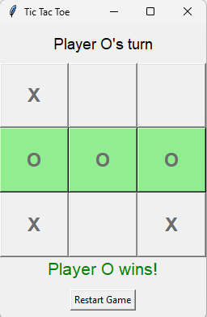

# Tic Tac Toe (Python GUI)

A simple Tic Tac Toe game built using Python with a graphical interface.

## Features
- Interactive 2-player gameplay
- Turn indicator
- Win & draw detection
- Winning cells highlighted
- Restart functionality

## Tech Stack
- Python
- Tkinter

## Preview

## How to Run
python main.py
